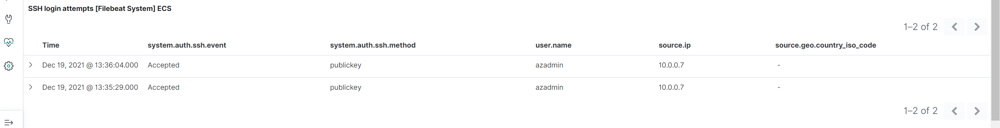
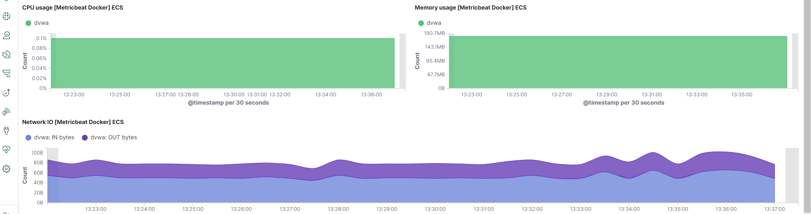

# Elk-Stack-Project
Repository of Elk Stack Server Project
## Automated ELK Stack Deployment

The files in this repository were used to configure the network depicted below.

These files have been tested and used to generate a live ELK deployment on Azure. They can be used to either recreate the entire deployment pictured above. Alternatively, select portions of the install-elk.yml file may be used to install only certain pieces of it, such as Filebeat.

This document contains the following details:
- Description of the Topology
- Access Policies
- ELK Configuration
  - Beats in Use
  - Machines Being Monitored
- How to Use the Ansible Build

### Description of the Topology

The main purpose of this network is to expose a load-balanced and monitored instance of DVWA, the D*mn Vulnerable Web Application.

Load balancing ensures that the application will be highly available, in addition to restricting access to the network.
- _TODO: What aspect of security do load balancers protect? What is the advantage of a jump box?_Load Balancers makes a single point access for multiple machines for a service, this creates high levels of availability for access.
The advantage of using a jump box is that it protects access to the service or machines using ssh as a means of access, without the key access being unavailable. 

Integrating an ELK server allows users to easily monitor the vulnerable VMs for changes to the log files and system resources.
- _TODO: What does Filebeat watch for?_Filebeat watches system logs and records any changes to them to Elasticsearch
- _TODO: What does Metricbeat record?_Metricbeat gathers system information such as resource and cpu usage which can be displayed in Elasticsearch
The configuration details of each machine may be found below.
_Note: Use the [Markdown Table Generator](http://www.tablesgenerator.com/markdown_tables) to add/remove values from the table_.

| Name     | Function           | IP Address | Operating System |
|----------|--------------------|------------|------------------|
| Jump Box | Gateway            | 10.0.0.7   | Ubuntu           |
| Web1     | Web Server         | 10.0.0.6   | Ubuntu           |
| Web2     | Web Server         | 10.0.0.8   | Ubuntu           |
| ELK      | ElasticSearchStack | 10.1.0.4   | Ubuntu           |

### Access Policies

The machines on the internal network are not exposed to the public Internet. 

Only the Jump Box machine can accept connections from the Internet. Access to this machine is only allowed from the following IP addresses:
- _TODO: Add whitelisted IP addresses_136.32.119.153

Machines within the network can only be accessed by the Jump Box.
- _TODO: Which machine did you allow to access your ELK VM? What was its IP address?_
JUMPBOX:
	Public IP:52.149.157.156
	Private IP:10.0.0.7
A summary of the access policies in place can be found in the table below.
_Note: Use the [Markdown Table Generator](http://www.tablesgenerator.com/markdown_tables) to add/remove values from the table_.

| Name          | Publicly Accessible | Allowed IP Address |
|---------------|---------------------|--------------------|
| Jump Box      | SSH-22-Yes          | 136.32.119.153     |
| Web1/Web2     | NO                  | 104.211.16.209     |
| Load Balancer | HTTP-80-Yes         | *                  |
| ELK           | Kibana-5601-Yes     | *                  |
| ELK           | HTTP-9200-Yes       | 10.0.0.0/16        |

### Elk Configuration

Ansible was used to automate configuration of the ELK machine. No configuration was performed manually, which is advantageous because...
- _TODO: What is the main advantage of automating configuration with Ansible?_The advantage of this method is that it allows for complete automation of a server reducing time and errors that can made in the setup process.
The playbook implements the following tasks:
- _TODO: In 3-5 bullets, explain the steps of the ELK installation play. E.g., install Docker; download image; etc._- Install Docker: Installs the code for the Docker to the remote server
- Install Python3_pip: Pip is an installation module that allows for other docker modules to be installed
- Docker Module: Tells PIP to install the needed docker modules
- Increase Memory: An issue with the ELK Docker is having too little memory. This can help fix the potential issue to allow the server to launch properly
- Download/Launch ELK Container: This downloads the ELK docker container and initializes it with the specified ports being published

The following screenshot displays the result of running `docker ps` after successfully configuring the ELK instance.

### Target Machines & Beats
This ELK server is configured to monitor the following machines:
- _TODO: List the IP addresses of the machines you are monitoring_
- 10.0.0.6
- 10.0.0.8
- 10.1.0.4
We have installed the following Beats on these machines:
- _TODO: Specify which Beats you successfully installed_Filebeat/Metricbeat were installed on: ELK, Web1, Web2
These Beats allow us to collect the following information from each machine:
- _TODO: In 1-2 sentences, explain what kind of data each beat collects, and provide 1 example of what you expect to see. E.g., `Winlogbeat` collects Windows logs, which we use to track user logon events, etc._Filebeat: collects system events such as login/logout of the system. This can be used to look for access attempts or changes to your system that were unwanted. 

Metiricbeat: collects information such as hardware usage. For instance memory/cpu usage statistics which can be used to look for unusual system behavior. 

### Using the Playbook
In order to use the playbook, you will need to have an Ansible control node already configured. Assuming you have such a control node provisioned: 

SSH into the control node and follow the steps below:
- Copy the install-elk.yml file to /etc/ansible/install-elk.yml.
- Update the hosts file to include [elk] 10.1.0.4 ansible_python_interpreter=/usr/bin/python3
- Run the playbook, and navigate to http://168.61.190.10:5601/app/kibana to check that the installation worked as expected.

_TODO: Answer the following questions to fill in the blanks:_
- _Which file is the playbook? install-elk.yml Where do you copy it?_
- _Which file do you update to make Ansible run the playbook on a specific machine? Hosts How do I specify which machine to install the ELK server on versus which to install Filebeat on?_ 
By specifying a section as [webservers] and [elk] you can differentiate where the installs occur. For EXAMPLE:
[webservers]
10.0.0.6 ansible_python_interpreter=/usr/bin/python3
10.0.0.8 ansible_python_interpreter=/usr/bin/python3

[elk]
10.1.0.4 ansible_python_interpreter=/usr/bin/python3

- _Which URL do you navigate to in order to check that the ELK server is running?
http://168.61.190.10:5601/app/kibana
